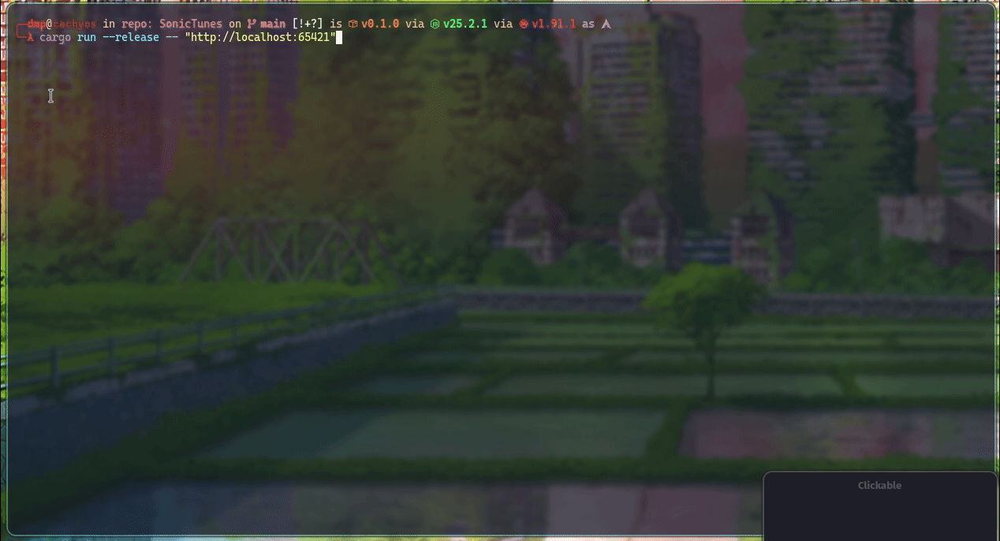

# SonicTunes

A TUI-based client for the [SubSonicVault](https://github.com/xDMPx/SubSonicVault) server, written in Rust.
Remotely play your music collection in the terminal.

## Preview

</img>

## Features

- Random playback
- Integration with OS media controls and metadata system
	- Linux - MPRIS
	- Windows - SystemMediaTransportControls
	- thanks to [souvlaki](https://crates.io/crates/souvlaki)
- [cmus](https://cmus.github.io/) inspired controls
- Command Mode
- History and Help view
- Pausing or quitting playback after a given time
- Multi-platform, runs on Linux and Windows, works within Termux

## Keybindings

| Key       | Action             |
| --------- | ------------------ |
| `z`       | Play Previous      |
| `b`       | Play Next          |
| `Space`   | Play / Pause       |
| `q`       | Quit               |
| `{`       | Volume -1          |
| `}`       | Volume +1          |
| `[`       | Volume -10         |
| `]`       | Volume +10         |
| ←         | Seek -10 s         |
| Shift + ← | Seek -60 s         |
| →         | Seek +10 s         |
| Shift + → | Seek +60 s         |
| `1`       | View Player        |
| `2`       | View History       |
| `0`       | View Help          |
| `j`       | Scroll Down        |
| `k`       | Scroll Up          |
| `:`       | Enter Command Mode |
| `Esc`     | Exit Command Mode  |

## Commands

| Command                        | Description                                                                                                            |
| ------------------------------ | ---------------------------------------------------------------------------------------------------------------------- |
| `quit` or `q`                  | Quit                                                                                                                   |
| `vol <value>`                  | Set the volume to `<value>` (e.g., `vol 50`). Negative or positive number adjusts the current volume (e.g., `vol +10`) |
| `seek <offset>`                | Seek by `<offset>` seconds (e.g., `seek -10`)                                                                          |
| `play-pause`                   | Toggle play/pause                                                                                                      |
| `stop`                         | Stop playback                                                                                                          |
| `play-next`                    | Play next                                                                                                              |
| `play-prev`                    | Play previous                                                                                                          |
| `pause-after <minutes>`        | Pause playback after `<minutes>` minutes                                                                               |
| `quit-after <minutes>`         | Quit the application after `<minutes>` minutes                                                                         |
| `view <player\|history\|help>` | Switch the view                                                                                                        |

## Building

To build, clone this repository and run:
```sh
cargo build --release
```

## Installation

### Linux

Locally:
```sh
CARGO_INSTALL_ROOT=~/.local cargo install --path=.
```

### Windows

Build the binary as described in [Building](#Building) section and use the generated executable in `target/release`.

## Usage

```
Usage: sonictunes [OPTIONS] SUBSONICVAULT_URL
       sonictunes --help
Options:
	 --volume=<value>	(0..100)
	 --verbose
	 --help
```

## License

This project is licensed under [MIT](LICENSE) License.
